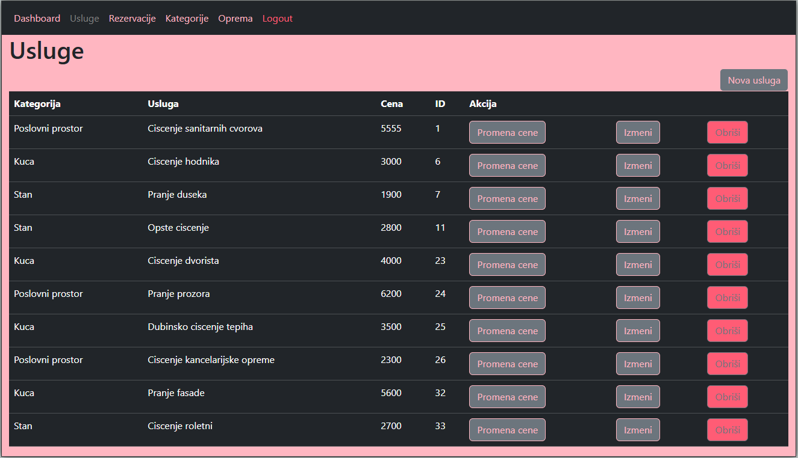
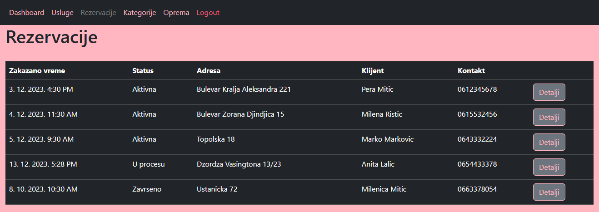
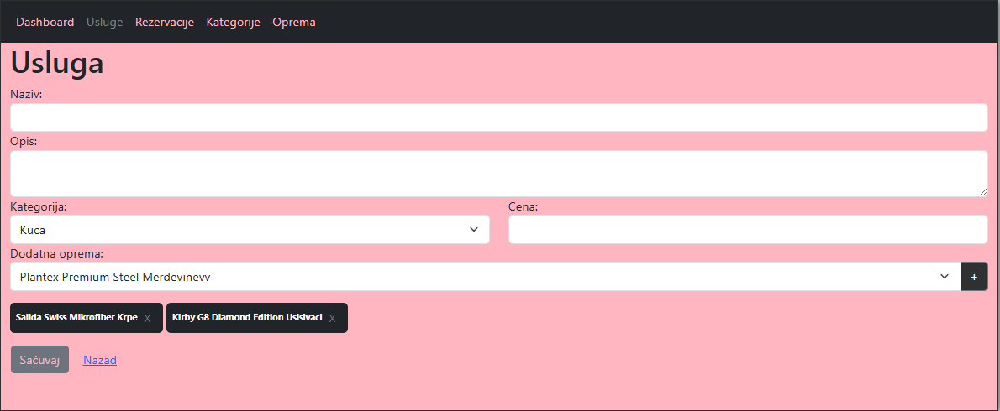

# PureShine Web App

This project was created as part of a University subject "Script languages" with the goal of building a web application for cleaning services. The application consists of two main parts: an admin panel for managing services and a user interface for viewing services and making reservations. The app is designed for the Serbian market, so all names are in Serbian.

## Table of Contents

1. [Application Architecture](#application-architecture)
2. [Technologies Used](#technologies-used)
3. [Features Overview](#features-overview)
    - [Admin Panel](#admin-panel)
    - [User Application](#user-application)
4. [Screenshots of the Application](#screenshots-of-the-application)
    - [Admin Panel - All Services View](#admin-panel-all-services-view)
    - [Admin Panel - Reservations View](#admin-panel-reservations-view)
    - [Admin Panel - Service Editing](#admin-panel-service-editing)
    - [User Application - All Services View (Homepage)](#user-application-all-services-view-homepage)
    - [User Application - Service Details](#user-application-service-details)

## Application Architecture

The app consists of three main services:

- **auth_servis**: Service responsible for user authentication.
- **api_servis**: Backend service that handles database interaction and API routes.
- **app_servis**: Frontend service that includes both the user and admin interfaces.

## Technologies Used

- **Backend**: Node.js, Express.js
- **Frontend**: Vue.js
- **Database**: MySQL
- **Authentication**: JSON Web Tokens (JWT)

## Features Overview

### Admin Panel
The admin panel allows:
- Viewing all available services.
- Managing reservations, including status updates.
- Adding, deleting, and editing existing services.

### User Application
Users can:
- Browse all available services on the homepage.
- Click on a service to view detailed information, including price and description.
- Create reservations for services.

## Screenshots of the Application

### Admin Panel - All Services View
On this page, the admin can view all available services with their basic details.

### Admin Panel - Reservations View
A page showing all current reservations with options for managing them.

### Admin Panel - Service Editing
A page for editing existing service details, such as name, description, and price.

### User Application - All Services View (Homepage)
On the homepage, users can browse through all available services.

### User Application - Service Details
A page displaying the details of a selected service, including its description, price, and the option to create a reservation.

